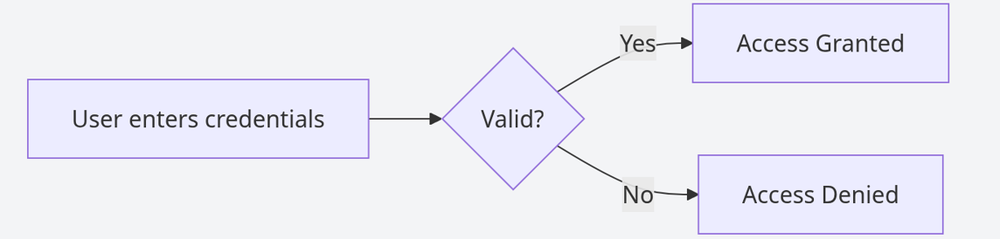

# 🔑 Authentication in Cybersecurity

## 📌 What is Authentication? 

Authentication is the process of verifying that a person is really who they claim to be before giving access to a system.

Authentication का मतलब है किसी व्यक्ति की पहचान को verify करना।

## Atuthentication Flow

## 🔐 How Authentication Works

When Riya logs into her email account, she enters her username and password. The system checks if the credentials are correct. If they match, she is allowed access.

But if someone else guesses her password and logs in, the system cannot differentiate between the real user and the attacker. This is how weak authentication leads to unauthorized access.

रिया जब अपना email login करती है, तो system check करता है कि password सही है या नहीं। अगर कोई और उसका password जानकर login कर ले, तो system उसे भी सही user मान लेता है।

---

## 🔒 Multi-Factor Authentication (MFA)

To make authentication stronger, systems use multiple verification methods.

MFA का मतलब है पहचान verify करने के लिए एक से ज़्यादा तरीके इस्तेमाल करना।

For example, after entering her password, Riya receives an OTP on her phone. Even if someone knows her password, they cannot log in without that OTP. This extra layer makes it much harder for attackers.

जैसे password के बाद OTP भी डालना पड़ता है, इससे security बढ़ जाती है।

---

## ⚠️ When Authentication Fails

Amit uses a weak password like “123456”. A hacker easily guesses it and logs into his social media account, posting messages and accessing private data.

Now others believe those actions were done by Amit, which shows how identity misuse happens when authentication is weak.

अगर password आसान हो, तो hacker आसानी से account access कर सकता है और गलत इस्तेमाल कर सकता है।

---

## 🎯 Interview Tip

Authentication answers the question, “Who are you?”

---

## 🚀 Key Takeaways

- Authentication verifies identity  
- Weak authentication leads to account compromise  
- MFA significantly improves security  
