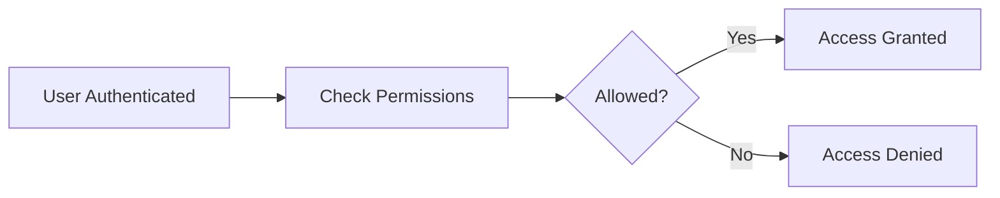

# 🔐 Authorization in Cybersecurity

## 📌 What is Authorization?

Authorization is the process of determining what actions a user is allowed to perform after they are authenticated.

Authorization का मतलब है, user को यह decide करना कि वह system में क्या कर सकता है और क्या नहीं।

Authentication answers “Who are you”, while authorization answers “What can you do”.

---

## 🧠 Understanding Through a Scenario

Riya logs into a company system using her credentials. She is successfully authenticated.

However, she can only view reports and cannot modify them. Meanwhile, her manager can edit and delete those reports.

In this case:
- Authentication verifies identity  
- Authorization defines permissions  

रिया login करने के बाद system में enter तो कर जाती है, लेकिन उसे limited access मिलता है, यही authorization है।

---

## 🔑 Key Concept

Authorization is based on **permissions and access control policies**.

It ensures:
- Users access only what they need  
- Sensitive data is protected  
- Unauthorized actions are prevented  

---

## 🔄 Types of Access Control

### 1. Role-Based Access Control (RBAC)

Access is assigned based on roles.

Example:
- Admin → Full access  
- Employee → Limited access  

RBAC में user को role के हिसाब से access दिया जाता है।

---

### 2. Attribute-Based Access Control (ABAC)

Access is based on multiple attributes like:
- User role  
- Location  
- Time  

Example:
A user can access data only during office hours.

ABAC में multiple conditions के आधार पर access मिलता है।

---

### 3. Discretionary Access Control (DAC)

Owner of the resource decides access.

Example:
A file owner gives access to others.

---

### 4. Mandatory Access Control (MAC)

Access is controlled by system policies, not users.

Example:
Government classified systems.

---

## 📊 Authorization Flow

## ⚠️ Common Issues

- Excessive permissions  
- Lack of proper role management  
- Privilege escalation attacks  

अगर user को ज़रूरत से ज्यादा access दिया जाए, तो misuse हो सकता है।

---

## 🎯 Interview Tips

- Clearly differentiate authentication vs authorization  
- Give real-world examples  
- Mention RBAC and ABAC  

---

## 🚀 Key Takeaways

- Authorization controls user actions  
- It works after authentication  
- Proper access control prevents misuse

---
