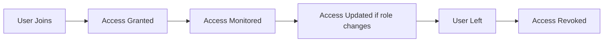

# 👤 Identity and Access Management (IAM)

## 📌 What is IAM?

Identity and Access Management is a framework that manages digital identities and controls user access to systems and resources.

IAM का मतलब है users की पहचान manage करना और उनके access को control करना।

---

## 🧠 Why IAM is Important

Organizations have:
- Employees  
- Customers  
- Vendors  

Each needs different access levels.

IAM ensures:
- Right person gets right access  
- Access is controlled and monitored  

---

## 🔑 Core Components of IAM

### Identity

Represents a user in the system.

Identity का मतलब है system में user की पहचान।

---

### Authentication

Verifying identity.

---

### Authorization

Defining access permissions.

---

### Access Control

Enforcing policies to restrict access.

---

## 🔄 IAM Lifecycle

## 📖 Real Scenario

A new employee joins a company.

He gets access to email, internal tools, and systems based on his role.

When he changes departments, his access is updated.

When he leaves, access is removed.

यह पूरा process IAM handle करता है।

---

## ⚠️ Common IAM Issues

- Orphan accounts  
- Excess privileges  
- Weak authentication  

---

## 🛡️ Best Practices

- Use least privilege principle  
- Enable MFA  
- Regular access reviews  

Least privilege का मतलब है user को सिर्फ उतना ही access देना जितना जरूरी है।

---

## 🎯 Interview Tips

- IAM = Authentication + Authorization + Access Control  
- Explain lifecycle clearly  

---

## 🚀 Key Takeaways

- IAM manages identities and access  
- It improves security and control  
- It is critical in modern organizations
 
---
