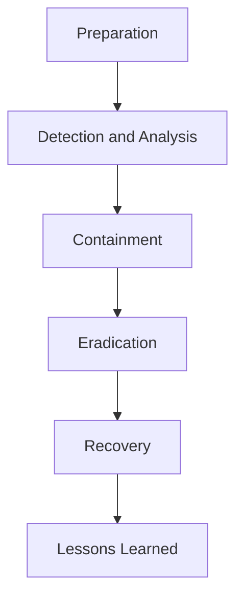

# 🚨 Incident Response Playbook

## 📌 What is Incident Response?

Incident response is the structured process of detecting, analyzing, containing, and recovering from cybersecurity incidents.

Incident response का मतलब है cyber attack होने पर उसे identify करना, control करना और system को normal स्थिति में वापस लाना।

It focuses on minimizing damage, reducing recovery time, and preventing future incidents.

---

## 🧠 Why Incident Response is Important

No system is completely secure, incidents are inevitable.

What matters is:
- How quickly the incident is detected  
- How effectively it is contained  
- How well the organization recovers  

अगर response slow हो, तो छोटा attack भी बड़ा नुकसान कर सकता है।

---

## 🔄 Incident Response Lifecycle

## 🔍 Phases Explained in Detail

### 1. Preparation

This phase focuses on being ready before any incident occurs.

Activities include:
- Creating incident response policies  
- Setting up monitoring tools (SIEM, IDS)  
- Defining roles and responsibilities  
- Conducting training and simulations  

Preparation का मतलब है attack होने से पहले पूरी तैयारी रखना।

---

### 2. Detection and Analysis

In this phase, the organization identifies whether an incident has occurred.

This includes:
- Monitoring logs and alerts  
- Identifying suspicious activities  
- Validating if it is a real incident  

Example:  
Multiple failed login attempts may indicate a brute-force attack.

Detection का मतलब है attack को जल्दी पहचानना।

---

### 3. Containment

Once the incident is confirmed, the goal is to limit its spread.

Actions include:
- Isolating affected systems  
- Blocking malicious IP addresses  
- Disabling compromised accounts  

Containment का मतलब है damage को फैलने से रोकना।

---

### 4. Eradication

This phase focuses on removing the root cause of the incident.

Activities include:
- Removing malware  
- Fixing vulnerabilities  
- Applying patches  

Eradication का मतलब है attack की जड़ को खत्म करना।

---

### 5. Recovery

Systems are restored to normal operation.

Steps include:
- Restoring backups  
- Re-enabling services  
- Monitoring systems for any unusual activity  

Recovery का मतलब है system को वापस normal स्थिति में लाना।

---

### 6. Lessons Learned

After the incident, the organization analyzes what happened.

Activities include:
- Documenting the incident  
- Identifying gaps in security  
- Improving processes and controls  

Lessons learned का मतलब है future में ऐसे attack को रोकने के लिए सीख लेना।

---

## 👥 Incident Response Team (IRT)

A typical incident response team includes:

- Security analysts  
- Incident responders  
- IT team  
- Management  
- Legal and compliance team  

हर team member की responsibility clear होनी चाहिए।

---

## 📊 Incident Severity Levels

Incidents are classified based on impact:

- Low, minor issue, minimal impact  
- Medium, moderate disruption  
- High, major system impact  
- Critical, data breach or business shutdown  

Severity decide करता है कि response कितना urgent होना चाहिए।

---

## 🛠️ Common Tools Used

- SIEM tools (log monitoring)  
- IDS/IPS (intrusion detection)  
- Endpoint security tools  
- Forensic tools  

Tools detection और investigation में मदद करते हैं।

---

## 📖 Real-World Scenario

A company notices unusual login activity late at night from multiple locations.

The security team investigates and confirms unauthorized access.

Steps taken:
- Affected systems are isolated  
- Compromised accounts are disabled  
- Malware is removed  
- Passwords are reset  

Systems are restored, and additional monitoring is implemented.

यह पूरा process incident response lifecycle को follow करता है।

---

## ⚠️ Common Mistakes

- Delayed detection  
- Lack of proper logging  
- No defined response plan  
- Poor communication  

अगर preparation नहीं हो, तो response slow और ineffective हो जाता है।

---

## 🛡️ Best Practices

- Maintain proper logs and monitoring  
- Have a clear incident response plan  
- Conduct regular drills  
- Use automation where possible  

Preparation strong होगी तो damage कम होगा।

---

## 🎯 Interview Tips

- Always mention all 6 phases  
- Explain with a real-world example  
- Focus on response speed and impact  
- Highlight business perspective  

---

## 🚀 Key Takeaways

- Incident response minimizes damage and downtime  
- Fast detection and response are critical  
- Preparation is the most important phase  
- Every organization must have an incident response plan
 
--- 
