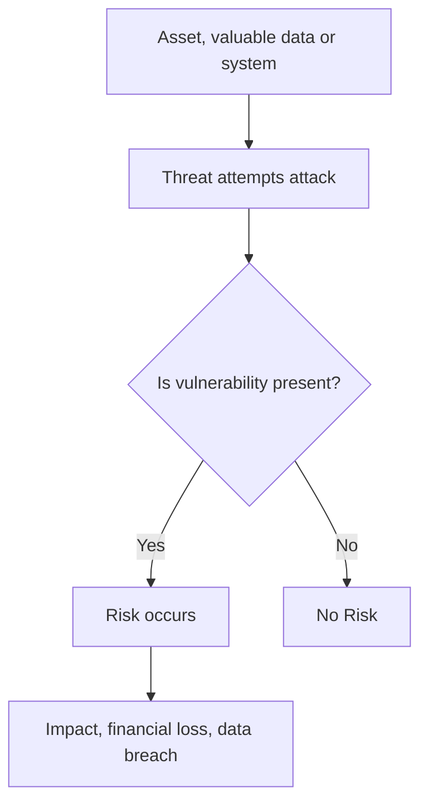

# ⚠️ Risk in Cybersecurity

## 📌 What is Risk?

Risk in cybersecurity refers to the possibility that a threat can exploit a vulnerability and cause harm to an asset.

Risk का मतलब है, किसी threat के द्वारा vulnerability का फायदा उठाकर asset को नुकसान होने की संभावना।

In practical terms, risk is not just about attacks happening, but about the **impact those attacks can create on business, users, and systems**.

Risk exists when three elements are present together:
- Asset, something valuable
- Threat, something that can cause harm
- Vulnerability, a weakness that can be exploited

If any one of these is missing, risk is significantly reduced.

---

## 🧠 Understanding Risk Through a Real Scenario

Rohit stores personal documents, banking details, and saved passwords on his laptop.  
He uses a weak password and frequently connects to public Wi-Fi networks.

An attacker on the same network monitors traffic, identifies Rohit’s device, and exploits his weak security. The attacker gains access and steals sensitive data.

In this situation:
- Asset is Rohit’s personal and financial data  
- Threat is the attacker on the network  
- Vulnerability is weak password and insecure network usage  
- Risk is the possibility of data theft and misuse  

रोहित का data asset है, attacker threat है, weak password vulnerability है, और data चोरी होने की संभावना risk है।

This example shows that risk is not theoretical, it directly impacts real users.

---

## 🔑 Key Components of Risk

### Asset

An asset is anything that has value to an individual or organization and needs protection.

Assets can include:
- Data, customer information, financial records  
- Systems, servers, applications  
- People, employees, users  
- Reputation, brand value  

Asset का मतलब है कोई भी valuable चीज़ जिसे protect करना ज़रूरी है।

---

### Threat

A threat is anything that has the potential to cause harm to an asset.

Threats can be:
- External attackers, hackers  
- Malware, ransomware  
- Insider threats, employees  
- Natural disasters, system failures  

Threat का मतलब है कोई भी ऐसा factor जो नुकसान पहुँचा सकता है।

---

### Vulnerability

A vulnerability is a weakness or gap in a system that can be exploited.

Common vulnerabilities include:
- Weak passwords  
- Outdated software  
- Misconfigured systems  
- Lack of security controls  

Vulnerability का मतलब है system की कमजोरी।

---

### Risk

Risk occurs when a threat successfully exploits a vulnerability and impacts an asset.

Risk तब होता है जब threat vulnerability का फायदा उठाकर asset को नुकसान पहुँचाता है।

---

## 📊 Risk Formula and Thinking

Risk is commonly expressed as:

Risk = Threat × Vulnerability × Impact

This formula helps in understanding:

- If vulnerability is low, risk decreases  
- If impact is high, risk becomes critical  
- Even a low probability threat can be serious if impact is very high  

In real-world scenarios, organizations prioritize risks based on impact rather than just likelihood.

---

## 📖 Practical Scenario (Business Perspective)

A company stores customer data on a cloud server.  
The system is not patched regularly, and access controls are weak.

An attacker identifies the vulnerability, gains access, and downloads sensitive data.

As a result:
- Customers lose trust  
- The company faces financial penalties  
- Legal action may be taken  

server update नहीं किया गया, security controls weak थे, attacker ने data leak कर दिया, जिससे company को नुकसान हुआ।

This highlights that risk is not just technical, it is also a **business problem**.

---

## ⚖️ Types of Risk

### Inherent Risk

This is the level of risk before any security controls are applied.

Inherent risk का मतलब है बिना किसी protection के system का risk।

Example, storing sensitive data without encryption.

---

### Residual Risk

This is the risk that remains even after applying controls.

Residual risk का मतलब है security लगाने के बाद भी जो risk बचता है।

No system can be 100 percent secure, so some level of risk always exists.

---

## 📊 Risk Assessment Approaches

Organizations use structured methods to evaluate risk.

### Qualitative Risk Assessment

This approach uses descriptive categories such as High, Medium, and Low.

Qualitative assessment में risk को levels में classify किया जाता है।

It is:
- Easy to understand  
- Fast to implement  
- Widely used in organizations  

Example, weak authentication marked as High Risk.

---

### Quantitative Risk Assessment

This approach uses numerical values and financial metrics.

Quantitative assessment में risk को numbers और financial impact के आधार पर measure किया जाता है।

It helps organizations:
- Estimate financial loss  
- Make business decisions  
- Justify security investments  

---

## 💰 Risk Calculations (Interview Focus + Security+/CISSP)

### Single Loss Expectancy (SLE)

SLE represents the financial loss from a single incident.

SLE = Asset Value × Exposure Factor

Example:
If a server worth ₹10,00,000 loses 40 percent value in an attack  
SLE = ₹10,00,000 × 0.4 = ₹4,00,000

---

### Annual Rate of Occurrence (ARO)

ARO represents how often an incident is expected per year.

Example:
If an attack happens once every 2 years  
ARO = 0.5

---

### Annual Loss Expectancy (ALE)

ALE represents expected yearly loss.

ALE = SLE × ARO

Example:
ALE = ₹4,00,000 × 0.5 = ₹2,00,000

This helps organizations decide whether investing in security controls is worth it.

---

## 🛡️ Risk Management

Risk management is the process of identifying, analyzing, and reducing risk to an acceptable level.

Risk management का मतलब है risk को समझना, evaluate करना और control करना।

It involves:
- Identifying risks  
- Assessing impact  
- Applying controls  
- Monitoring continuously  

---

## 🔄 Risk Treatment Options

Organizations handle risk using four main strategies.

### Risk Avoidance

Stop the activity causing the risk.

Example, not storing sensitive data online.

---

### Risk Mitigation

Reduce the risk using security controls.

Example, encryption, firewalls, MFA.

---

### Risk Transfer

Transfer risk to another entity.

Example, cyber insurance, third-party vendors.

---

### Risk Acceptance

Accept the risk when it is low or unavoidable.

This is a conscious business decision.

---

## 🏢 Real-World Organizational Scenario

A fintech company manages sensitive customer data, including bank details and personal information.

The company continues using outdated software and delays security updates. Employees access systems using weak passwords, and monitoring is limited.

An attacker scans the system, identifies known vulnerabilities, and gains access. Using weak credentials, the attacker moves laterally and extracts customer data.

As a result:
- Customer data is leaked  
- The company faces regulatory penalties  
- Trust is damaged, leading to customer loss  

In this scenario:
- Asset is customer data and systems  
- Threat is the attacker  
- Vulnerability is outdated software and weak authentication  
- Impact is financial loss and reputation damage  

इस situation में company ने vulnerabilities को ignore किया, जिससे बड़ा नुकसान हुआ।

---

## 🎯 Interview Tips

- Always explain risk with a real-world scenario  
- Clearly mention asset, threat, vulnerability, and impact  
- Focus on business impact, not just technical details  
- Use simple language, avoid over-complication  
- If possible, include risk calculation or treatment  

---

## 🚀 Key Takeaways

- Risk is the combination of threat, vulnerability, and impact  
- It is a business-level concern, not just technical  
- Risk cannot be eliminated, only managed  
- Every organization operates with some level of risk  
- Understanding risk is essential for cybersecurity and CISSP

---
